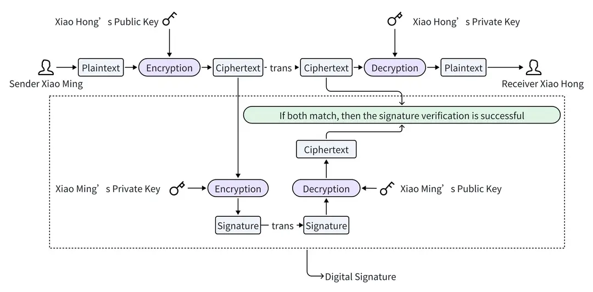
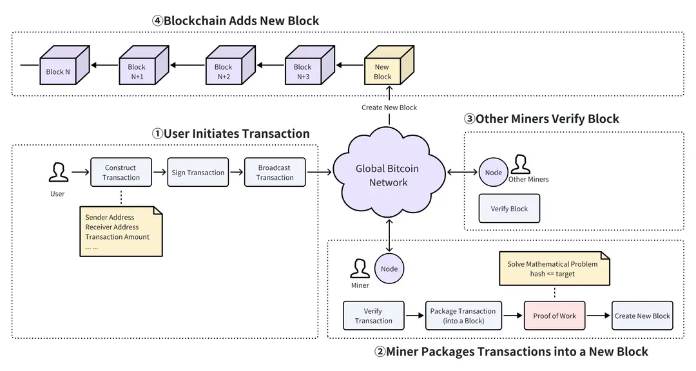

# 2026-04-02 | HackQuest Day 12

**Course:** 흔한 사기 수법(Common Fraud Tactics) 
**Lesson:** 허가서명 (Permit Signature Scams)
**Time:** 30min

---

## 핵심 개념

### 이더리움 거래 
이더리움에서는 디지털 서명 기술을 사용하여 거래의 진위성과 무결성을 보장

- 사용자의 거래 서명
    1. 거래 데이터의 해시값을 계산
    2. 타원 곡선 디지털 서명 알고리즘(ECDSA)을 사용하여 해시값에 서명
    3. 서명 값(v, r, s)을 첨부하여 거래 데이터를 브로드캐스트

- 채굴자 거래 검증
    1. 거래를 수신하면 채굴자들은 거래 데이터(서명 제외)의 해시값을 계산하고, ECDSA 알고리즘을 사용하여 서명과 해시값으로부터 사용자의 공개키를 복구
    2. 복구된 공개키를 사용자의 지갑 주소와 비교하고, 두 정보가 일치하면 거래가 성공적으로 검증된 것

※ 디지털 서명 알고리즘(ECDSA): 1. 서명은 데이터에 개인 키를 사용하여 그 데이터에 디지털 도장을 찍는 것 (내 개인 키를 가진 사람만 만들 수 있는 도장) 2. 검증은 공개 키를 사용하여 상대방의 디지털 도장이 맞는지 확인하는 것

위 두 가지의 요소를 합친 것이 디지털 세상의 신뢰를 만들어냄.

### 포로제도 역사 소개
작업증명(PoW) 개념은 원래 1993년 신시아 드워크와 모니 나오르가 이메일 서비스에 대한 스팸 고격을 방지하기 위한 수단으로 제안한 것

사용자가 이메일을 보내기 전에 내용과 관련된 수학 문제를 풀도록 요구하고, 그 결과를 이메일에 첨부하여 서버에서 수락하도록 하는 것

### 절차
1. 사용자가 이메일을 작성
2. 이메일을 보내기 전에 사용자는 작업증면 문제를 해결
3. 메일 서버는 이메일과 첨부된 숫자를 수신하고 정확성을 신속하게 검증
4. 작업증명이 올바르면 이메일이 지정된 사서함으로 전송되고, 그렇지 않으면 전송이 거부됨

작업증명 (PoW)방식을 비트코인 개발에 적용.
이 매커니즘 합의를 통해 비트코인 네트워크에 탈중앙화된 보안을 제공하고, 특정 기관에 의존하지 않고 네트워크가 안정적으로 운영되도록 보장하며, 네트워크의 무결성을 유지함.

### 포로수용소 매커니즘
문제는 기본적으로 블록 헤더의 해시값이 네트워크 헤더의 해시값이 네트워크의 현재 난이도 목표값보다 작거나 같도록 하는
1에서 2^256 사이의 값(nonce)를 찾는 과정을 "채굴"

### PoW 매커니즘 사례 연구
작업증명(PoW) 매커니즘의 작동 방식을 간단한 예시로 설명.
블록 헤더의 해시값이 목표 난이도보다 작거나 같도록, 즉 해시값이 세 개의 0으로 시작하도록 하는 논스(nonce) 값을 찾는 것

- 위험도 존재: 2014년 GHash.IO 채굴 풀은 한때 전 세계 비트코인 네트워크 연산 능력의 절반 이상을 차지 했고, 이론적으로는 "51% 공격"을 실행할 수 있는 가능성을 내포했다고 하였으며 네트워크 전체의 39.99%를 넘지 않도록 자발적으로 연산 능력을 조절했다고 한다.

=
## 느낀 점 / 다음에 볼 것

타임 오버, 시간 지키기
